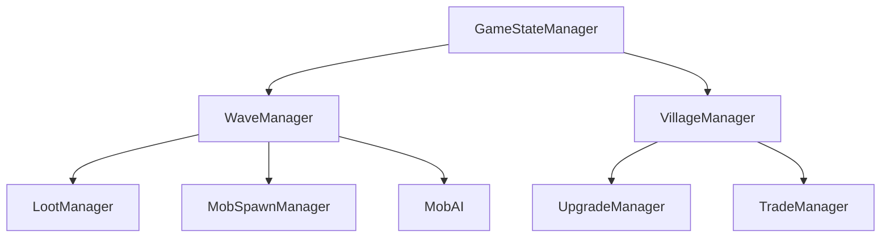

# Bastion Plugin Design Document

## 1. System Architecture

### Component Overview
- **GameStateManager**: Controls game lifecycle and state transitions
  - States: LOBBY, PREPARING, ACTIVE, COMPLETED
  - Manages player participation and game session boundaries
  - Coordinates wave progression and completion conditions

- **WaveManager**: Handles wave mechanics and progression
  - Controls wave states: INACTIVE, PREPARING, ACTIVE, COMPLETED
  - Manages mob spawning and wave completion
  - Implements difficulty scaling and player count adjustments

- **VillageManager**: Manages village-related functionality
  - Tracks registered villagers and their states
  - Handles village center location and boundaries (100x100 area)
  - Coordinates village protection mechanics
  - Sets world spawn point at village center

- **BarrierManager**: Manages the protective barrier system
  - Creates visible particle barrier (100x100 area)
  - Prevents natural mob spawning within barrier
  - Clears friendly mobs to optimize hostile mob spawning
  - Enforces player movement restrictions

- **MobSpawnManager**: Controls custom mob spawning
  - Forces mob spawning regardless of light levels
  - Manages mob lifetime (5-minute despawn/respawn cycle)
  - Ensures zombies don't burn in sunlight
  - Spawns mobs at ground level within barrier

- **Economy System**:
  - **LootManager**: Handles mob drops and rewards
    - Implements tiered drop tables (normal/elite/boss)
    - Scales rewards with wave progression
    - Manages enchanted item generation
  - **UpgradeManager**: Manages progression systems
    - Player upgrades: DAMAGE_BOOST, PROTECTION, SPEED_BOOST
    - Village upgrades: VILLAGER_HEALTH, BARRIER_STRENGTH, VILLAGER_REGEN
  - **TradeManager**: Handles villager trading mechanics

### Data Flow


### State Management
1. **Game States**
   - LOBBY: Player gathering and preparation
   - PREPARING: 10-second setup phase
   - ACTIVE: Wave progression active
   - COMPLETED: End-game state with statistics

2. **Wave States**
   - INACTIVE: Between games
   - PREPARING: Pre-wave countdown
   - ACTIVE: Ongoing wave
   - COMPLETED: Post-wave rewards

## 2. Game Flow

### Wave Progression
1. **Difficulty Scaling**
   - Base multiplier: 1.5x per wave
   - Mob health: Base × 1.5^(wave_number)
   - Player scaling: +30% mob health per player
   - Base mob count: 10 + (2 × number_of_players)

2. **Wave Structure**
   - 10-second preparation time between waves
   - Wave completion requires eliminating all spawned mobs
   - Boss waves every 10 rounds
   - Elite mobs every 5 waves
   - Mob lifetime: 5 minutes (auto-respawn for better pathfinding)

3. **Mob Spawning System**
   - Forced spawning at ground level within 100x100 barrier
   - Zombies immune to sunlight damage
   - Natural mob spawning disabled in barrier area
   - Friendly mobs cleared to optimize hostile mob cap usage
   - Any mob death (player, golem, explosion) counts toward wave progress

### Economy Balance
1. **Resource Generation**
   - Base emerald drops:
     - Normal mobs: 10% chance
     - Elite mobs: 30% chance
     - Boss mobs: Guaranteed 5 + (1.5 × wave_number)
   - Wave completion bonus: 5 base emeralds + (1.5 × wave_number)
   - Villager protection bonus: 3 emeralds per saved villager

2. **Upgrade Costs**
   - Base costs:
     - Combat upgrades: 8-12 emeralds
     - Village upgrades: 10-20 emeralds
   - Cost scaling: Base × current_level
   - Maximum levels: 3-5 depending on upgrade type

### Upgrade Paths
1. **Player Upgrades**
   - Damage Boost (8 emeralds, max level 5)
   - Protection (12 emeralds, max level 5)
   - Speed Boost (10 emeralds, max level 3)

2. **Village Upgrades**
   - Villager Health (10 emeralds, max level 5)
     - +5 health per level
   - Barrier Strength (15 emeralds, max level 3)
   - Villager Regeneration (20 emeralds, max level 3)

### Player Progression
1. **Early Game (Waves 1-5)**
   - Focus on basic gear acquisition
   - Initial village protection upgrades
   - Resource accumulation

2. **Mid Game (Waves 6-15)**
   - Elite mob encounters
   - Upgrade specialization
   - Enhanced trading options

3. **Late Game (Waves 16+)**
   - Boss battle preparation
   - Maximum upgrade completion
   - High-tier gear acquisition

## 3. Configuration Guide

### Game Settings
```yaml
wave:
  base-mob-count: 10
  mobs-per-player: 2
  difficulty-multiplier: 1.5
  scaling:
    health: 1.5
    damage: 1.5
  player-scaling:
    mob-health: 0.3

village:
  barrier:
    size: 100  # 100x100 block area
    particle-frequency: 2  # degrees between particles
    particle-height-spacing: 4  # blocks between vertical particles
  villagers:
    health-multiplier: 2.0
    regeneration:
      enabled: true
      amount: 1.0

mob-spawning:
  spawn-interval: 40  # ticks (2 seconds)
  mob-lifetime: 6000  # ticks (5 minutes)
  spawn-distance:
    min: 35  # blocks from village center
    max: 45  # blocks from village center
  sunlight-immunity: true  # zombies don't burn in daylight

economy:
  rewards:
    wave-completion: 5
    boss-wave-completion: 20
    villager-saved: 3
  trading:
    enhanced-trades-unlock-wave: 5
    boss-wave-special-trades: true
```

### Commands
- `/bastion findvillage` - Find and select a village, set spawn point
- `/bastion barrier` - Toggle the protective barrier
- `/bastion start` - Start the game
- `/bastion stop` - Stop current game
- `/bastion info` - Show game status
- `/bastion upgrade player <type>` - Purchase player upgrades
- `/bastion upgrade village <type>` - Purchase village upgrades
- `/bastion upgrades` - List available upgrades

### Permissions
All commands are available to all players by default (permission level: "not op"):
- `bastion.admin` - Administrative access
- `bastion.play` - Basic participation rights
- `bastion.start` - Ability to start games
- `bastion.stop` - Ability to stop games

### Customization
- Visual effects:
  ```yaml
  effects:
    barrier:
      visible: true
      particle-density: 0.5
    spawn:
      warning-sound: true
      warning-particles: true
  ```
- Debug options:
  ```yaml
  debug:
    enabled: false
    log-wave-stats: false
  ```

## 4. Technical Notes

### Performance Considerations
1. **Entity Management**
   - Mob spawning is staggered to prevent server strain
   - Entity cleanup on wave completion
   - Efficient entity tracking systems

2. **Memory Usage**
   - State data stored in memory during active games
   - Cleanup on game completion
   - Minimal persistent storage requirements

### Scalability
1. **Multi-Game Support**
   - Independent game state tracking
   - Separate village instances
   - Isolated progression systems

2. **Player Scaling**
   - Dynamic difficulty adjustment
   - Resource distribution scaling
   - Balanced for 1-8 players

### Known Limitations
1. **Game Boundaries**
   - Fixed 100×100 play area
   - Single village center per game
   - Maximum 8 players per session

2. **Technical Constraints**
   - Paper API 1.21.3+ required
   - No external plugin dependencies
   - Server performance dependent on mob count
   - Mob spawning requires ground-level surface access

### Recent Improvements
1. **Barrier System Enhancements**
   - 100x100 barrier area with improved visibility
   - Prevention of natural mob spawning within barrier
   - Automatic clearing of friendly mobs for better mob cap management
   - Enhanced particle effects for better barrier visualization

2. **Mob Spawning Improvements**
   - Forced spawning system independent of light levels
   - 5-minute mob lifetime with automatic respawning
   - Zombie sunlight immunity for day/night gameplay
   - Ground-level spawning with sky access validation

3. **Gameplay Balance**
   - All players can access commands without OP status
   - Any mob death counts toward wave progress (not just player kills)
   - Village spawn point automatically set when selecting village
   - Optimized mob cap usage for more aggressive spawning

### Future Improvements
1. **Planned Features**
   - Multiple village support
   - Custom mob types
   - Advanced AI patterns
   - Achievement system

2. **Optimization Opportunities**
   - Enhanced mob pathfinding
   - More efficient loot distribution
   - Improved player scaling mechanics
   - Additional upgrade paths